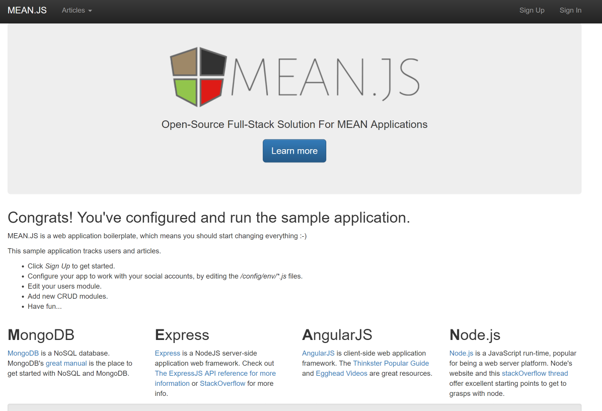

# Open Source Workloads in Azure with Linux
## Install components to make our VM a Web Server

Now that we are inside our machine we need to install these tools:

1. MongoDB
1. Node.js
1. The rest of the packages

### Package managers (.deb and .rpm)

There are many out in the wild but these are some of the most popular ones. The first one is the high-level package manager that provides a simple way to retrieve and install packages including dependency resolution and multiple sources. Then we have the low-level package manager that can only install, remove, provide info and build packages. The con is that it does not automatically download and install the package dependencies.

1. **YUM (NDF) -> RPM** - Red Hat Enterprise Linux (RHEL), CentOS, Scientific Linux, Fedora, etc.
1. **Advanced Packaging Tool (APT-GET) * -> DPKG** - Ubuntu, Debian, KNOPPIX, etc.(Debian based distros)
1. **ZYPPER -> RPM** - Open SUSE, SUSE Linux Enterprise Server

### Install `yum`

First of all lets get the latest definitions for yum:

```
sudo yum update
```

And press `y` to confirm the update

This will take a few minutes to finish, when it is done the last line should say `Complete!` and we should be back at the command prompt. 

## Install MongoDB

### Tell yum about MongoDB
First lets add the MongoDB repository to yum. To do that we need to create a file containing the MongoDB info to the `'/etc/yum.repos.d/'` folder. 

Start by coping and pasting the following into your shell and then press `ctrl+d` to end the editing session.

```
cat >mongodb.org-3.2.repo
[mongodb-org-3.2]
name=MongoDB Repository
baseurl=https://repo.mongodb.org/yum/redhat/$releasever/mongodb-org/3.2/x86_64/
gpgcheck=0
enabled=1
gpgkey=https://www.mongodb.org/static/pgp/server-3.2.asc

```
    
Now usie the following command you can see the file you just created.

```
cat mongodb.org-3.2.repo
```

Now lets move the file into the proper folder, using the `'mv'` command.

```
sudo mv mongodb.org-3.2.repo /etc/yum.repos.d
```

We need to make sure it has the right permissions and ownership, `'ls -la'` allows us to see who owns the file and what permissions it has assigned.

```
ls -la /etc/yum.repos.d
```

The output should look something like this:

```
total 52
drwxr-xr-x.  2 root  root  4096 Sep 16 16:53 .
drwxr-xr-x. 87 root  root  8192 Sep 16 16:38 ..
-rw-r--r--.  1 root  root  1706 May 17 19:05 CentOS-Base.repo
-rw-r--r--.  1 root  root  1309 Aug 30 15:53 CentOS-CR.repo
-rw-r--r--.  1 root  root   649 Aug 30 15:53 CentOS-Debuginfo.repo
-rw-r--r--.  1 root  root   314 Aug 30 15:53 CentOS-fasttrack.repo
-rw-r--r--.  1 root  root   630 Aug 30 15:53 CentOS-Media.repo
-rw-r--r--.  1 root  root  1331 Aug 30 15:53 CentOS-Sources.repo
-rw-r--r--.  1 root  root  3830 Aug 30 15:53 CentOS-Vault.repo
-rw-rw-r--.  1 shawn shawn  200 Sep 16 16:49 mongodb.org-3.2.repo
-rw-r--r--.  1 root  root   282 May 17 19:05 OpenLogic.repo
```

The first thing we noticed is tha the file is owned by `'user'`  from the group `'user'` (the user and group that created the file) while the rest of the files belong to `'root'`. To transfer the file to root we need to run the following command:

```
sudo chown root:root /etc/yum.repos.d/mongodb.org-3.2.repo
```

The file now belongs to `'root'`, you can verify this with the `'ls -la'` command. like so:

```
ls -la /etc/yum.repos.d
```

You should now see the following:

```
total 52
drwxr-xr-x.  2 root root 4096 Sep 16 16:53 .
drwxr-xr-x. 87 root root 8192 Sep 16 16:38 ..
-rw-r--r--.  1 root root 1706 May 17 19:05 CentOS-Base.repo
-rw-r--r--.  1 root root 1309 Aug 30 15:53 CentOS-CR.repo
-rw-r--r--.  1 root root  649 Aug 30 15:53 CentOS-Debuginfo.repo
-rw-r--r--.  1 root root  314 Aug 30 15:53 CentOS-fasttrack.repo
-rw-r--r--.  1 root root  630 Aug 30 15:53 CentOS-Media.repo
-rw-r--r--.  1 root root 1331 Aug 30 15:53 CentOS-Sources.repo
-rw-r--r--.  1 root root 3830 Aug 30 15:53 CentOS-Vault.repo
-rw-rw-r--.  1 root root  200 Sep 16 16:49 mongodb.org-3.2.repo
-rw-r--r--.  1 root root  282 May 17 19:05 OpenLogic.repo    
```

We can notice that the file has the following permissions: `-rw-rw-r--.`
    
We can fix the permissions with the following command.

```
sudo chmod 644 /etc/yum.repos.d/mongodb.org-3.2.repo
```

The file should now have `-rw-r--r--.` permissions, , you can verify this with the `'ls -la'` command. like so:

```
ls -la /etc/yum.repos.d
```

You should now see the following:

```
total 52
drwxr-xr-x.  2 root root 4096 Sep 16 16:53 .
drwxr-xr-x. 87 root root 8192 Sep 16 16:38 ..
-rw-r--r--.  1 root root 1706 May 17 19:05 CentOS-Base.repo
-rw-r--r--.  1 root root 1309 Aug 30 15:53 CentOS-CR.repo
-rw-r--r--.  1 root root  649 Aug 30 15:53 CentOS-Debuginfo.repo
-rw-r--r--.  1 root root  314 Aug 30 15:53 CentOS-fasttrack.repo
-rw-r--r--.  1 root root  630 Aug 30 15:53 CentOS-Media.repo
-rw-r--r--.  1 root root 1331 Aug 30 15:53 CentOS-Sources.repo
-rw-r--r--.  1 root root 3830 Aug 30 15:53 CentOS-Vault.repo
-rw-r--r--.  1 root root  200 Sep 16 16:49 mongodb.org-3.2.repo
-rw-r--r--.  1 root root  282 May 17 19:05 OpenLogic.repo    
```

### Install MongoDB with yum

Start the installation with the following command, and press `y` to Confirm the installation, when it is done is should say `Complete!`

```
sudo yum install mongodb-org
```

### Start the MongoDB service:

```
sudo systemctl start mongod
```

And make sure it's running

```
sudo systemctl status mongod
```

You should see something like this in your shell:

```
● mongod.service - SYSV: Mongo is a scalable, document-oriented database.
Loaded: loaded (/etc/rc.d/init.d/mongod)
Active: active (running) since Thu 2016-10-13 01:39:07 UTC; 5s ago
    Docs: man:systemd-sysv-generator(8)
Process: 48902 ExecStart=/etc/rc.d/init.d/mongod start (code=exited, status=0/SUCCESS)
CGroup: /system.slice/mongod.service
        └─48913 /usr/bin/mongod -f /etc/mongod.conf

Oct 13 01:39:07 chentos systemd[1]: Starting SYSV: Mongo is a scalable, document-oriented database....
Oct 13 01:39:07 chentos runuser[48909]: pam_unix(runuser:session): session opened for user mongod by (uid=0)
Oct 13 01:39:07 chentos runuser[48909]: pam_unix(runuser:session): session closed for user mongod
Oct 13 01:39:07 chentos mongod[48902]: Starting mongod: [  OK  ]
Oct 13 01:39:07 chentos systemd[1]: Started SYSV: Mongo is a scalable, document-oriented database..
```

## Install Node.js

First install the epel-release with the following command, and press `y` to Confirm the installation, when it is done is should say `Complete!`

```
sudo yum install epel-release
```

Next, Install [NodeJS](https://nodejs.org), with the following command, and press `y` to Confirm the installation TWICE, when it is done is should say `Complete!`

```
sudo yum install nodejs
```

Now Check the installed version of NodeJS and [NPM](https://www.npmjs.com/)

To check the version of `node` execute the following

```
node --version
```

you should see this

```
v6.11.1
```

To check teh version of `npm` execute the following

```
npm version
```

you should see this:

```JSON
{ npm: '3.10.10',
    ares: '1.10.1-DEV',
    http_parser: '2.7.1',
    icu: '50.1.2',
    modules: '48',
    node: '6.11.1',
    openssl: '1.0.1e-fips',
    uv: '1.10.2',
    v8: '5.1.281.103',
    zlib: '1.2.7' }
```

## The rest of the packages

### Install Bower
We are going to use the [Bower Package Manager](http://bower.io/) to manage our front-end packages. Execute the following to install it.

```
sudo npm install -g bower
```

### Install Git
We will be using `'git'` to clone directories. Execute the following to install it. Don't forget to confirm the install.

```
sudo yum install git
```

### Install MEAN.JS

We clone the latest version of [MEAN.JS](https://github.com/meanjs/mean) boilerplate

```
git clone https://github.com/meanjs/mean.git meanjs
```

And we move to the meanjs folder we just created

```
cd meanjs
```

We can now install all the depondencies for the boilerplate

```
npm install
```

> When the npm packages install process is over, npm will initiate a bower install command to install all the front-end modules needed for the application

> To update these packages later on, just run npm update

## Start the node server
We can run the app now:

```
npm start
```

We should see something like this

```
+ Important warning: config.domain is empty. It should be set to the fully qualified domain of the app.
--
MEAN.JS - Development Environment

Environment:     development
Server:          http://0.0.0.0:3000
Database:        mongodb://localhost/mean-dev
App version:     0.5.0
MEAN.JS version: 0.5.0
--
```

## View your app
On your PC, open your browser and navigate to your web servers URL, port 3000. The URL is the FQDN we used earlier, plus the port number. 

Mine looks like this

```
http://zzoe5ntiwjdl2fg.westus2.cloudapp.azure.com:3000/
```

You should see the default MEAN.JS homepage



## Lab Navigation
1. [Overview](./)
1. [Setup your environment](./step01.html)
1. [Create a Linux VM in Azure](./step02.html)
1. [Connect to a Linux VM in Azure](./step03.html)
1. [Install components to make our VM a Web Server](./step04.html) *<-- you are here*
1. [Cleanup](./step05.html)

[Back to Index](../../index.html)        