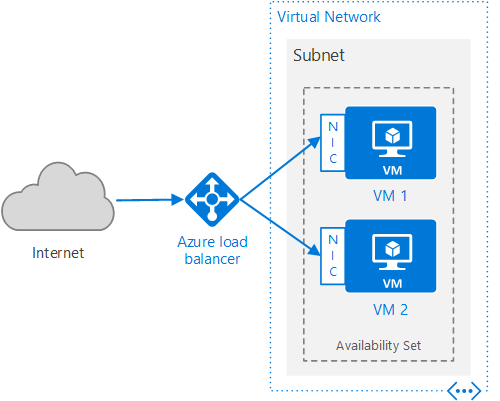

# Single Region High Availability Lab

Created at Microsoft by [Shawn Weisfeld](https://github.com/shawnweisfeld)

## In this lab we will:
1. Deploy two Windows VMs and install IIS on each
1. The VMs will be placed in an [Availability Set](https://docs.microsoft.com/en-us/azure/virtual-machines/windows/manage-availability) to be in scope for the [99.95% VM SLA](https://azure.microsoft.com/en-us/support/legal/sla/virtual-machines)
1. Each VMs will use [Managed Storage](https://docs.microsoft.com/en-us/azure/virtual-machines/windows/managed-disks-overview) 
1. An Azure Internet Facing [Load balancer](https://docs.microsoft.com/en-us/azure/load-balancer/load-balancer-internet-overview) will be used to distribute web traffic between the VMs
1. VMs will be placed inside a [Virtual Network/Subnet](https://docs.microsoft.com/en-us/azure/virtual-network/virtual-networks-overview) with appropriate [Network Security Groups](https://docs.microsoft.com/en-us/azure/virtual-network/virtual-networks-nsg) to limit traffic. 

This lab is based on the following article: [Run load-balanced VMs for scalability and availability](https://docs.microsoft.com/en-us/azure/architecture/reference-architectures/virtual-machines-windows/multi-vm). NOTE: at the time of writing this lab the ARM template at the bottom of the article is broken.

## Lab Navigation
1. [Overview](./) *<-- you are here*
1. [Connect to the Azure Cloud Shell](./step01.html)
1. [Select your subscription](./step02.html)
1. [Create the Resource Group](./step03.html)
1. [Create the Availability Set](./step04.html)
1. [Create the first vm](./step05.html)
1. [Create the second VM same as the first](./step06.html)
1. [Add the load balancer](./step07.html)
1. [Look Mom its magic](./step08.html)
1. [Extending this lab and Cleanup](./step09.html)
1. [CLI commands Summary](./summary.html)

[Back to Index](../../index.html)