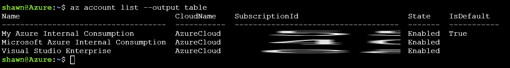

# Single Region High Availability Lab 
## Step 2 - Select your subscription

Now that we know how to ask for help, lets run the following command to list the available Azure Subscriptions tied to your account. 

```
az account list --output table
``` 

> Note: you can copy paste commands from here into the portal, however you must use the mouse when pasting into the portal. 

Your output should look something like this:



Take note of the `--output table` switch. This takes the output from the `list` command and formats it in an easy to read table. 

You can see that I have 3 Azure subscriptions. You might only have one, however if you have more than one ensure that the one you want to use for the lab today is set as default. If the proper subscription is not set to default you can change it with this command.

```
az account set --subscription 'Subscription Name'
```

It is also a good idea to take a look at the Azure Regions available to your subscription, we will be using one of these regions for our lab today.

```
az account list-locations --output table
```

When picking a region I look at a few factors for example: Does the region have the Azure services I need ([check the list here](https://azure.microsoft.com/en-us/regions/services/))? Is the region close to me and in the right geo-political area? For todays lab you can use just about any Azure region as the IaaS services we are going to use are available in most regions. 


## Lab Navigation
1. [Overview](./)
1. [Connect to the Azure Cloud Shell](./step01.html)
1. [Select your subscription](./step02.html) *<-- you are here*
1. [Create the Resource Group](./step03.html)
1. [Create the Availability Set](./step04.html)
1. [Create the first vm](./step05.html)
1. [Create the second VM same as the first](./step06.html)
1. [Add the load balancer](./step07.html)
1. [Look Mom its magic](./step08.html)
1. [Extending this lab and Cleanup](./step09.html)
1. [CLI commands Summary](./summary.html)

[Back to All Labs](../../index.html)