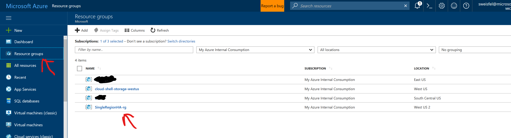

# Single Region High Availability Lab 
## Step 3 - Create the Resource Group

A resource group is a container that holds related resources for an Azure solution. The resource group can include all the resources for the solution, or only those resources that you want to manage as a group. You decide how you want to allocate resources to resource groups based on what makes the most sense for your organization and workload. [See Resource groups](https://docs.microsoft.com/en-us/azure/azure-resource-manager/resource-group-overview#resource-groups). For todays exercise we are going to place everything into one resource group, this will make cleaning up at the end of the lab simple. 

Before we create our resource group, lets first declare 2 variables to hold the name of our resource group and the region we will be using today. Execute the following two commands:

```
RG="SingleRegionHA-rg"

REGION="westus2"
```

> NOTE: if you loose your connection to the Azure Cloud Shell you might need to redefine your variables.

Now we can create the resource group.

```
az group create --location $REGION --name $RG
```

After you run this command you will see a response from Azure in json providing details about the resource group you just created. However one of the nice things about the CLI being in the portal is that it is easy to view resources as you create/modify/delete them, all in the same window. For example lets click on "Resource Groups" in the Portal Navigation bar. This should pull up the list of all your Resource Groups, here you can select the one that we just created. 



> NOTE: Remember, everything we are creating via the CLI can also be created using the Portal, PowerShell commands or an ARM template. Many users will start with the Portal when they are learning, and then migrate to the CLI, PowerShell or an ARM template as their skills and processes mature. 

## Lab Navigation
1. [Overview](./) 
1. [Connect to the Azure Cloud Shell](./step01.html)
1. [Select your subscription](./step02.html)
1. [Create the Resource Group](./step03.html) *<-- you are here*
1. [Create the Availability Set](./step04.html)
1. [Create the first vm](./step05.html)
1. [Create the second VM same as the first](./step06.html)
1. [Add the load balancer](./step07.html)
1. [Look Mom its magic](./step08.html)
1. [Extending this lab and Cleanup](./step09.html)
1. [CLI commands Summary](./summary.html)