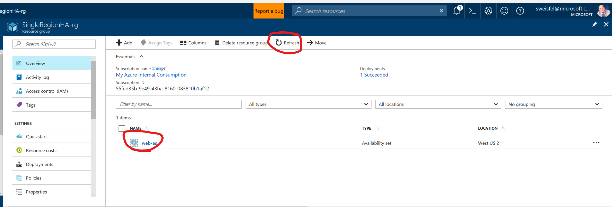
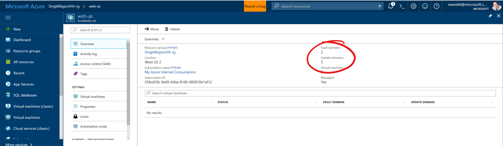

# Single Region High Availability Lab 
## Step 4 - Create the Availability Set

An Availability Set is our way of telling Azure what a tier of our application looks like. For example a traditional 3 tier application will consist of a Web Tier (filled with web servers), an Application Tier (filled with application servers), and a Database Tier (you guessed it, filled with database servers). Each of the servers inside a given tier of our applications will be configured the same. This allows us to load balance traffic between the servers, and if one of our servers in an Availability Set gets sick, we can route traffic to the others. 

Azure goes the extra step and ensures that VMs in the same Availability Set don't share physical components. Reducing the chance that a single physical outage (VM Host machine, top of rack network switch, etc.) can impact all the VMs in a given Availability Set. Additionally, if we are using Managed Storage, Azure will ensure that the Disks that our VMs rely on are on different storage devices, reducing the chance that a storage device failure will impact all of the VMs in our Availability Set. 

```
az vm availability-set create --name "web-as" --resource-group $RG --location $REGION
```

After you run the command, press the refesh button and look at what you did.



Also try and click on the name of the availability set, and take a look at the overview tab. Here you will see that the Availability set we created has 2 Fault Domains and 5 Update Domains. Each VM we deploy will be deployed into a Fault Domain and Update Domain. Fault domains ensure the physical isolation we were talking about earlier. Update domains are used for planned maintenance. 



> For the rest of the lab today I encourage you to pull up the resources we are going to create via the CLI in the portal and take a look at the options you have available to you. I am not going to include screen shots of each interesting setting. 

## Lab Navigation
1. [Overview](./) 
1. [Connect to the Azure Cloud Shell](./step01.html)
1. [Select your subscription](./step02.html)
1. [Create the Resource Group](./step03.html)
1. [Create the Availability Set](./step04.html) *<-- you are here*
1. [Create the first vm](./step05.html)
1. [Create the second VM same as the first](./step06.html)
1. [Add the load balancer](./step07.html)
1. [Look Mom its magic](./step08.html)
1. [Extending this lab and Cleanup](./step09.html)
1. [CLI commands Summary](./summary.html)

[Back to All Labs](../index.html)