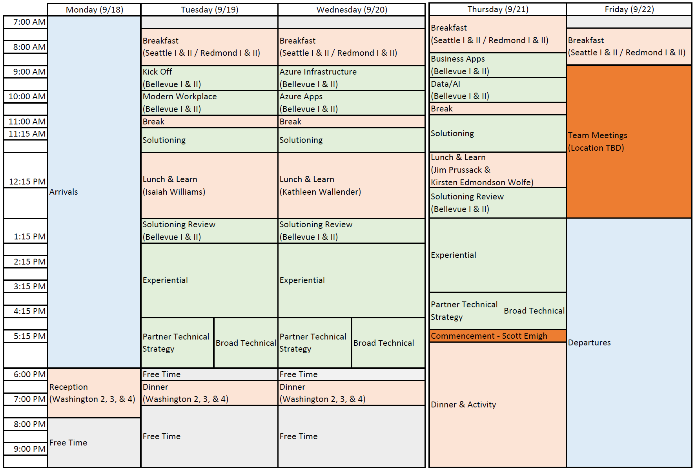

# FY18 P20 Summer Camp

## Day 1
### Modern Workspace
 - [General Session PPT](./ModernWorkplace/mw-general-session.pptx)
 - [Cloud Solution Provider - Integration](./ModernWorkplace/CloudSolutionProvider-Integration.pptx)
 - [PTS Session](https://aka.ms/OCPMWP)
 - Solutioning
    - [Solutioning and Review](./ModernWorkplace/MW-Solutioning-and-Review-v1.7.pptx)
    - [Security](./ModernWorkplace/security/P20ModernWorkplaceSecurity.pptx )
    - [Developer](./ModernWorkplace/dev/WorkingLife-Balance.pptx)
 - Experiential
    - [Security](./ModernWorkplace/security/)
    - [Developer](./ModernWorkplace/dev/lab1-graph-explorer.md) 
    - [Applying Microsoft Teams in the Real World](./ModernWorkplace/experiential-guide-v2.docx)

## Day 2
### Azure Apps
 - [Solutioning](https://1drv.ms/w/s!ApNjXNBDMrWt2zNEDRjyKEpH1Lgm)
 - [Experiential](https://1drv.ms/b/s!ApNjXNBDMrWt2zQbDuj6I_6WHZnR)

### Azure Infrastructure
 - [Solutioning](./AzureIaaS/solutioning.html)
 - Experiential
    - [Run load-balanced VMs for scalability and availability](./AzureIaaS/SingleRegionHALab/)
    - [Open Source Workloads in Azure with Linux](./AzureIaaS/AzureOSS/)
    - [Simple App Containerization hands-on lab with Docker](./AzureIaaS/SimpleContainers/)
    - [Containers Orchestrator hands-on lab with Kubernetes](./AzureIaaS/KubernetesContainers/)

## Day 3
### Data and AI
 - [Solutioning](./DataAi/)
 - [Experiential](https://github.com/chmitch/p20camp-dataandai)

### Business Apps
 - [Tribridge](./BusinessApps/Tribridge-P20-Presentation.pptx)
 - [Solutioning](./BusinessApps/solutioning-scenario.pdf)
 - Experiential
     - [Microsoft Dynamics 365 for Customer Service](./BusinessApps/customer-service.pdf)
     - [Microsoft Dynamics 365 for Project Service Automation](./BusinessApps/project-service-automation.pdf)
     - [Microsoft Dynamics 365 for Sales Workshop](./BusinessApps/sales-workshop.pdf)
